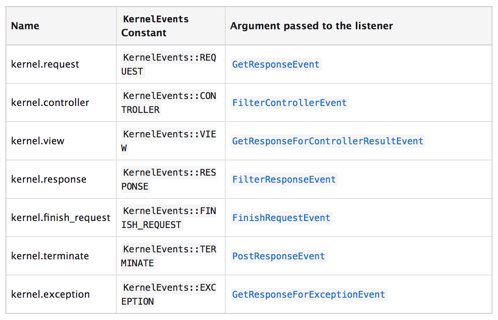

# Eventos

Durante la ejecución de una aplicación Symfony, se lanzan muchas notificaciones de eventos. Nuestra aplicación puede escuchar estas notificaciones y responder a ellas ejecutando un trozo de código.

En Symfony la gestión de eventos la realiza el componente **EventDispatcher**. Este componente implementa el patrón *Mediator* para gestionar los eventos.

Por ejemplo, justo cuando symfony crea el objeto Response, puede ser útil que otros elementos del sistema, servicios, bundles, etc tuvieran acceso a ella para modificarla (por ejemplo, para añadir algunas headers de caché). El funcionamiento para hacer esto posible sería el siguiente:

1) Un listener (un objeto PHP) le dice al EventDispatcher que quiere escuchar el evento kernel.response;
2) En un momento dado, el kernel de Symfony le dice al EventDispatcher que "dispare" el evento kernel.response, pasándole un objeto Event que tiene acceso al objeto Responses.
3) El EventDispatcher notifica a (es decir, llama a un método de) todos los listeners del evento kernel.response, permitiendo a cada uno de ellos realizar modificaciones en el objeto Response.

> composer require symfony/event-dispatcher

## EventDispatcher

La forma de notificar al EventDispatcher que queremos notificar la ocurrencia de un evento, es la que sigue:

```php
use Symfony\Component\EventDispatcher\EventDispatcher;
use Symfony\Component\EventDispatcher\Event;

$dispatcher = new EventDispatcher();
$dispatcher->dispatch('producto.creado', new Event());
```

El método *dispatch()* recibe dos argumentos: el nombre del evento y una instacia de *Event* con la información del evento.

En el ejemplo, hemos pasado al dispatcher un evento sin ninguna información, pero es muy fácil pasar una instancia de Event con la información que queramos:

```php
namespace App\Event;

use Symfony\Component\EventDispatcher\Event;
use App\Entity\Producto;

class ProductoCreadoEvent extends Event
{
    const NAME = 'producto.creado';

    protected $producto;

    public function __construct(Producto $producto)
    {
        $this->producto = $producto;
    }

    public function getProducto()
    {
        return $this->producto;
    }
}
```

y pasárselo al Dispatcher al notificar el evento:

```php
use App\Entity\Producto;
use Acme\Event\ProductoCreadoEvent;


$producto = new Producto();
// ...

$evento = new ProductoCreadoEvent($producto);
$dispatcher->dispatch(ProductoCreadoEvent::NAME, $evento);
```

## Dispatcher Shortcuts

El segundo parámetro del método dispatch es opcional. Si no se le pasa, el propio Dispatcher creará un Event básico.

```php
$dispatcher->dispatch('producto.creado');
```

NOTA: En versiones muy recientes de symfony se han intercambiado los argumentos del método dispatch().

```php
$dispatcher->dispatch($evento, ProductoCreadoEvent::NAME);
```

Y ahora el nuevo segundo parámetro es el opcional:

```php
$dispatcher->dispatch($evento);
```

En este caso, el nombre del evento será ProductoCreadoEvent::class.

Además, el dispather siempre devuelve el objeto pasado como evento:

```php
$evento = new ProductoCreadoEvent($producto);
$producto = $dispatcher->dispatch(ProductoCreadoEvent::NAME, $event)->getProducto();
```

## Creación de un listener

Para crear un listener hay que crear una clase con un método que recibirá la instancia del objeto Event y en el que ejecutaremos la lógica que deseemos que se ejecute al producirse el evento.

```php
// src/EventListener/ExceptionListener.php
namespace App\EventListener;

use Symfony\Component\HttpKernel\Event\GetResponseForExceptionEvent;
use Symfony\Component\HttpFoundation\Response;
use Symfony\Component\HttpKernel\Exception\HttpExceptionInterface;

class ExceptionListener
{
    public function onKernelException(GetResponseForExceptionEvent $event)
    {
        // You get the exception object from the received event
        $exception = $event->getException();
        $message = sprintf(
            'My Error says: %s with code: %s',
            $exception->getMessage(),
            $exception->getCode()
        );

        // Customize your response object to display the exception details
        $response = new Response();
        $response->setContent($message);

        // HttpExceptionInterface is a special type of exception that
        // holds status code and header details
        if ($exception instanceof HttpExceptionInterface) {
            $response->setStatusCode($exception->getStatusCode());
            $response->headers->replace($exception->getHeaders());
        } else {
            $response->setStatusCode(Response::HTTP_INTERNAL_SERVER_ERROR);
        }

        // sends the modified response object to the event
        $event->setResponse($response);
    }
}
```

Una vez creada la clase y su método, hay que registrarla como un servicio y decirle a symfony que es un listener y que está asociado al evento deseado:


```yml
# config/services.yaml
services:
    App\EventListener\ExceptionListener:
        tags:
            - { name: kernel.event_listener, event: kernel.exception }
 
```

Hay un atributo opcional llamado *method* que define qué método de la clase App\EventListener\ExceptionListener es el que Symfony debe ejectuar cuando ocurra el evento. Si no se indica dicho atributo, entonces se busca un método llamado:

```
on + "camel-cased event name"
```

En este caso sería *onKernelException()*.

NOTA: A partir de Symfony 4.1, si no existe un método 

```
on + "camel-cased event name"
```

se busca un método que se llame **__invoke()**.

El otro atributo opcional es *priority*, que por defecto vale 0, y controla el orden en el que los listeners serán ejecutados. Cuanto mayor sea el número de *priority*, antes se ejecutará el listener. Pueden ser números positivos y/o negativos.

## Event Name Introspection

Además del Event, al listener le llegan el nombre del evento y la propia instancia del EventDispatcher.

```php
use Symfony\Component\EventDispatcher\Event;
use Symfony\Component\EventDispatcher\EventDispatcherInterface;

class Foo
{
    public function myEventListener(Event $event, $eventName, EventDispatcherInterface $dispatcher)
    {
        // ... do something with the event name
    }
}
```

## Cómo parar la propagación de un evento

En algunos casos, tiene sentido que un listener prevenga a los demás listeners del mismo evento de ser llamados. En otras palabras, un listener puede decirle al Dispatcher que pare la propagación del evento a los siguientes listeners.

Para ello, el objeto Event dispone de un método llamado *stopPropagation()*.

```php
use Acme\Store\Event\OrderPlacedEvent;

public function onStoreOrder(OrderPlacedEvent $event)
{
    // ...

    $event->stopPropagation();
}
```

Los siguientes listeners que hubiera por orden de prioridad ya no serán llamados.

El objeto Event también dispone de un método is *isPropagationStopped()* para saber si un evento ha sido parado.

```php
$dispatcher->dispatch('foo.event', $event);
if ($event->isPropagationStopped()) {
    // ...
}
```

## Event Subscribers

Otra forma de escuchar un evento es a través de un **event subscriber**.

Un *event subscriber* es una clase PHP que es capaz de decirle al dispatcher exactamente a qué eventos quiere suscribirse.

Implementa el interfaz **EventSubscriberInterface** que requiere que exista un método estático llamado **getSubscribedEvents()**.

Veamos un ejemplo:

```php
namespace Acme\Store\Event;

use Symfony\Component\EventDispatcher\EventSubscriberInterface;
use Symfony\Component\HttpKernel\Event\FilterResponseEvent;
use Symfony\Component\HttpKernel\KernelEvents;
use Acme\Store\Event\OrderPlacedEvent;

class StoreSubscriber implements EventSubscriberInterface
{
    public static function getSubscribedEvents()
    {
        return array(
            KernelEvents::RESPONSE => array(
                array('onKernelResponsePre', 10),
                array('onKernelResponsePost', -10),
            ),
            OrderPlacedEvent::NAME => 'onStoreOrder',
        );
    }

    public function onKernelResponsePre(FilterResponseEvent $event)
    {
        // ...
    }

    public function onKernelResponsePost(FilterResponseEvent $event)
    {
        // ...
    }

    public function onStoreOrder(OrderPlacedEvent $event)
    {
        // ...
    }
}
```

Esto es muy similar a un listener, salvo por el hecho de que un subscriber puede decir por sí mismo al dispatcher qué eventos quiere escuchar.

Para registrar un subscriber en el dispatcher no hay que hacer nada especial siempre que tengamos el **autoconfigure** habilitado en nuestro fichero *services.yaml*.

El dispatcher registrará al subscriber para cada evento devuelto por el método getSubscribedEvents().

## Eventos del Kernel


Durante el procesamiento de una petición HTTP, el framework Symfony (o cualquier aplicación que utilice el componente HttpKernel) genera varios eventos que se pueden utilizar para modificar cómo se procesa la request.

### La clase KernelEvent

Cada evento generado por el componente HttpKernel es una subclase de la clase KernelEvent
Each event dispatched by the HttpKernel component is a subclass of KernelEvent, la cual proporciona la siguiente información:

- getRequestType()

Devuelve el tipo de petición (HttpKernelInterface::MASTER_REQUEST o HttpKernelInterface::SUB_REQUEST). Una subrequest es una request realizada desde twig mediante **reder(controller())**.

- getKernel()

Devuelve el objeto Kernel que está manejando la request.

- getRequest()

Devuelve el objeto request actual.

### Lista de eventos del Kernel

#### kernel.request

Event Class: GetResponseEvent

Este evento se genera antes de determinar qué controlador se va a utilizar para procesar la petición. Es útil para añadir información a la request o para devolver una Response rápida saltándo el flujo normal del framework.

Con el siguiente comando podemos ver todos los listeners suscritos a este evento:

> bin/console debug:event-dispatcher kernel.request

#### kernel.controller

Event Class: FilterControllerEvent

Este evento se genera después de que se resuelva cuál es el controlador asociado a la petición, pero antes de ejectuar dicho controlador. Se puede utilizar, por ejemplo para añadir datos necesarios para el controlador o incluso para cambiar el controlador que se va a ejecutar.

Con el siguiente comando podemos ver todos los listeners suscritos a este evento:

> bin/console debug:event-dispatcher kernel.controller

#### kernel.view

Event Class: GetResponseForControllerResultEvent

Este evento se genera después de que el controlador haya sido ejecutado pero únicamente si no ha devuelto un objeto Response. Es útil para transformar el valor retornado por el controlador en un objeto Response.

Con el siguiente comando podemos ver todos los listeners suscritos a este evento:

> bin/console debug:event-dispatcher kernel.view

#### kernel.response

Event Class: FilterResponseEvent

Este evento se genera después de que el controlador o un listener de kernel.view hayan devuelto un objeto Response. Es útil para modificar la respuesta (por ejemplo añadir cabeceras http, añadir cookies...).

Con el siguiente comando podemos ver todos los listeners suscritos a este evento:

> bin/console debug:event-dispatcher kernel.response

#### kernel.finish_request

Event Class: FinishRequestEvent

Este evento se genera después de que una subrequest haya terminado. Es útil para restablecer valores globales de la aplicación. Por ejemplo, el listener de traducciones resetea el parámetro *locale* al valor que tenía la request padre.

Con el siguiente comando podemos ver todos los listeners suscritos a este evento:

> bin/console debug:event-dispatcher kernel.finish_request

#### kernel.terminate

Event Class: PostResponseEvent

Este evento se genera después de que la respuesta haya sido enviada. Es útil para realizar tareas complejas y/o lentas que no necesitan estar terminadas para mandar la respuesta (por ejemplo, enviar emails).

Con el siguiente comando podemos ver todos los listeners suscritos a este evento:

> bin/console debug:event-dispatcher kernel.terminate

#### kernel.exception

Event Class: GetResponseForExceptionEvent

Este evento se genera tan pronto como ocurre un error. Es útil para modificar la información de la excepción que se envía en la respuesta.

Con el siguiente comando podemos ver todos los listeners suscritos a este evento:

> bin/console debug:event-dispatcher kernel.exception

### Resumen de eventos del Kernel

En esta imagen podemos ver un resumen de los eventos del Kernel:



## Consideraciones finales

### Listeners o Subscribers

En la misma aplicación pueden coexistir listeners y subscribers sin problemas. La decisión de cuál utilizar es más bien de gustos personales.

Los subscribers están más autocontenidos. En el mismo archivo está la información de a qué evento están suscritos y la propiar programación de lo que hacen.

Los listeners, sin embargo, son un poco más flexibles ya que se pueden habilitar y deshabilitar por configuración.

### Depurando Event Listeners

Existe un comando para listar todos los eventos y sus listeners:

> bin/console debug:event-dispatcher

También existe un comando para listar los listeners de un determinado evento:

> bin/console debug:event-dispatcher kernel.exception

## Enlaces interesantes

El patrón Mediator: https://en.wikipedia.org/wiki/Mediator_pattern